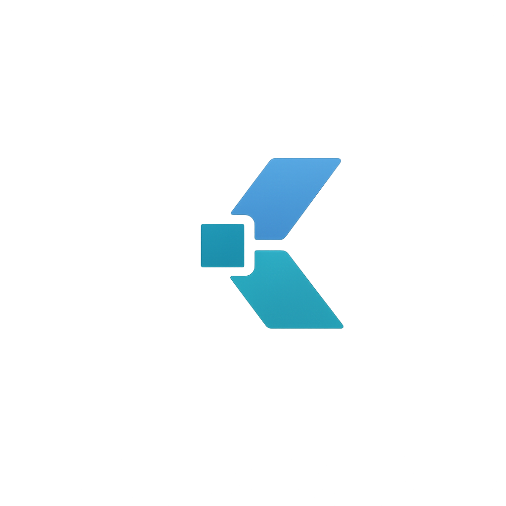
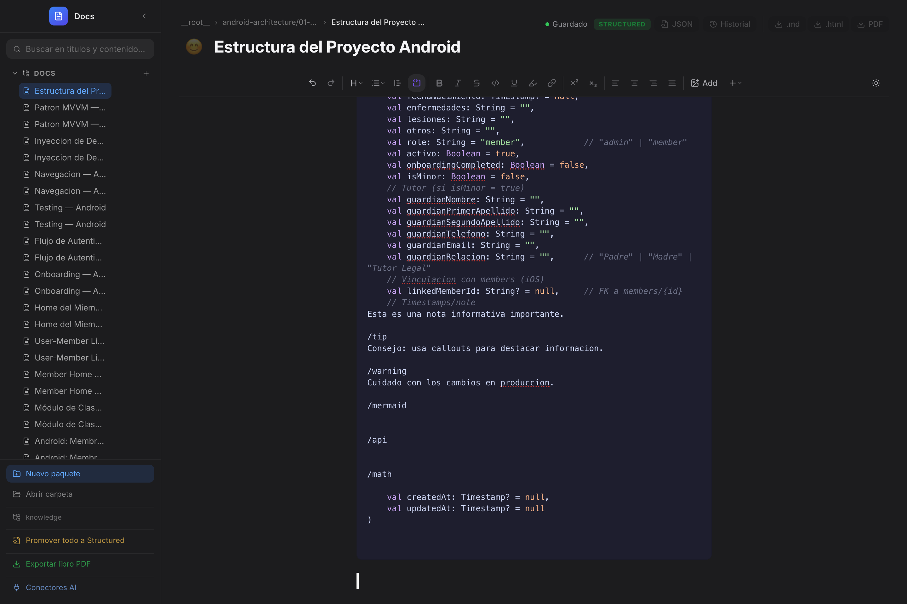
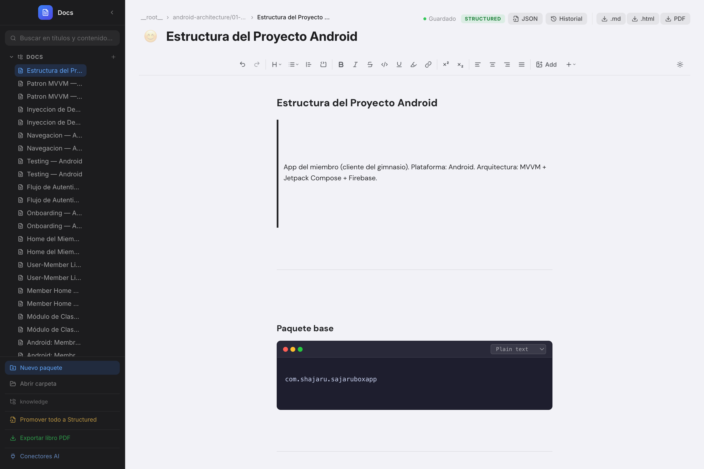
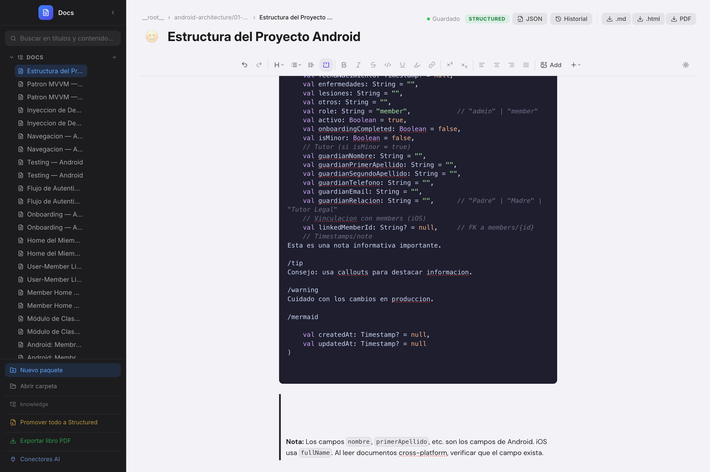
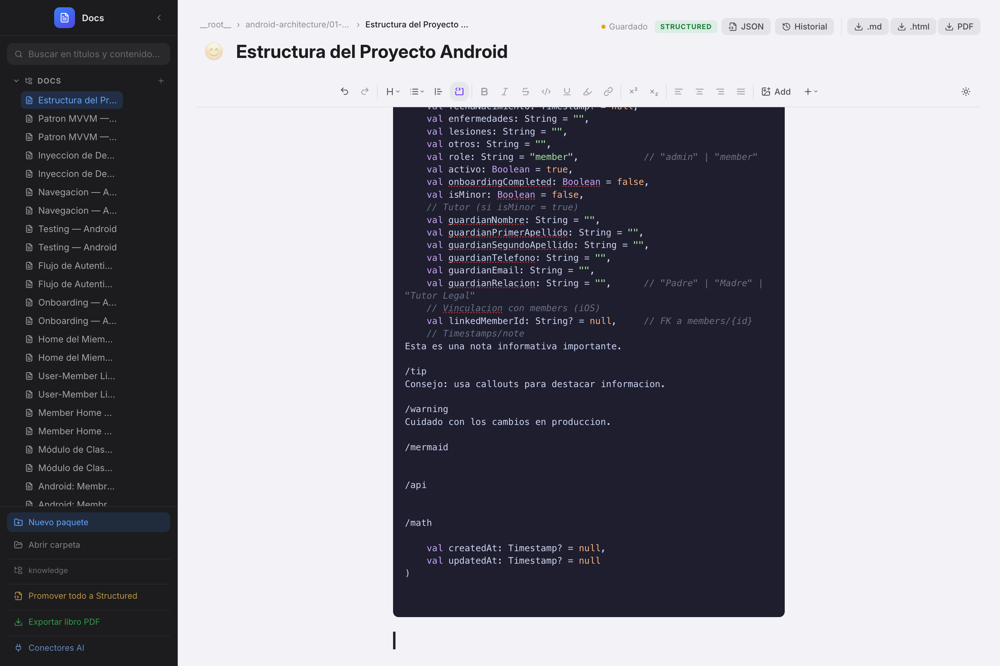
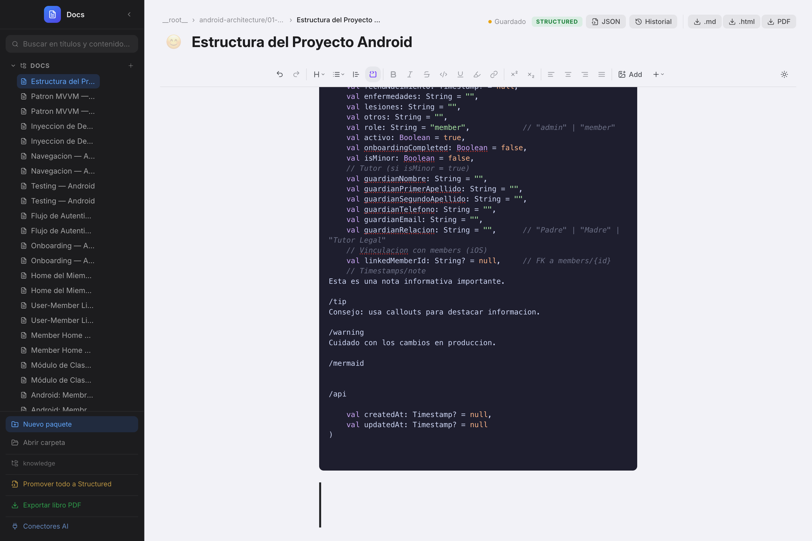
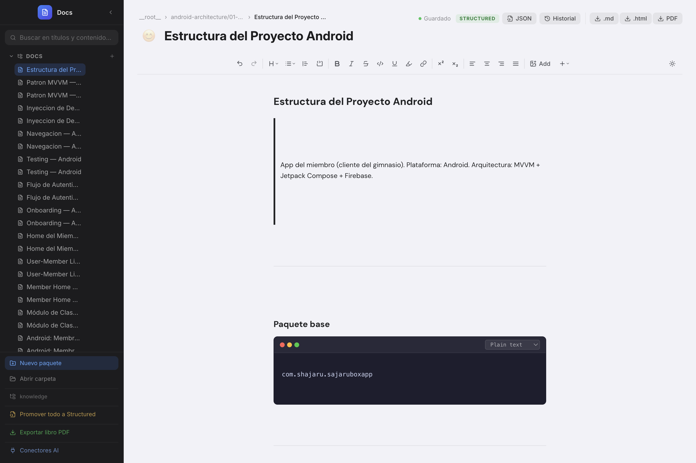
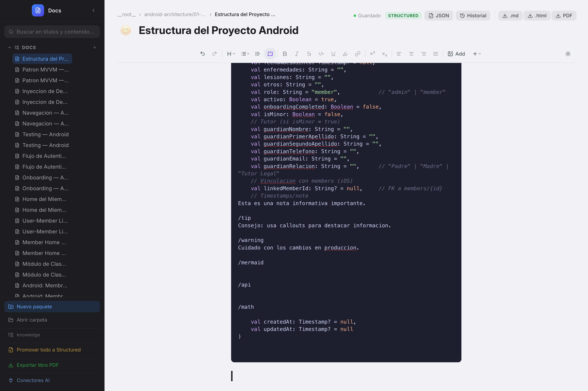
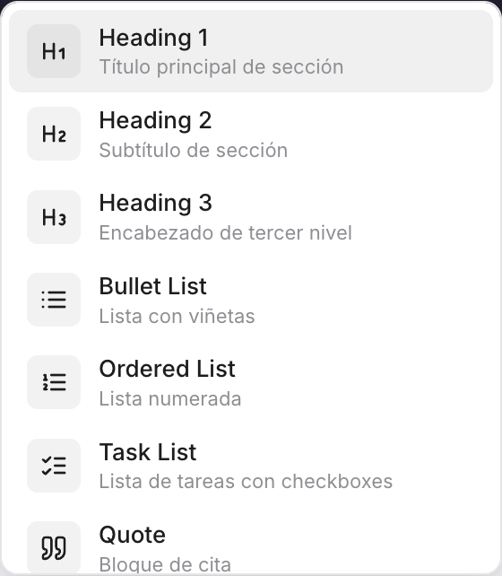

<p align="center">
  
</p>

<h1 align="center">Kuilo</h1>

<p align="center">
  <strong>IDE de documentacion tecnica — local-first, offline, con MCP nativo.</strong><br/>
  Del nahuatl <em>tlacuilo</em>: el escriba que documenta conocimiento.
</p>

<p align="center">
  
  
  
  
</p>

---

## Que es Kuilo?

Kuilo es un IDE de documentacion tecnica que corre 100% local en tu maquina. Sin cuentas, sin cloud, sin suscripcion. Tus documentos son archivos JSON planos que cualquier herramienta puede leer — incluyendo LLMs via MCP.

Pensado para equipos de una persona que documentan sistemas completos: APIs, arquitectura, runbooks, PRDs, RFCs, y mas.



---

## Features

### Editor de bloques

Editor visual tipo Notion/Obsidian con soporte completo de Markdown:

- **Texto rico** — bold, italic, underline, strike, code, superscript, subscript
- **Headings** H1-H4 con estilos visuales
- **Listas** — bullet, ordenadas, task lists con checkboxes
- **Blockquotes** con borde lateral
- **Code blocks** con syntax highlighting (lowlight) y selector de lenguaje
- **Tablas** editables con resize de columnas
- **Imagenes** con upload drag & drop
- **Links** con auto-linking de URLs
- **Toggle lists** — bloques colapsables
- **Dividers** — lineas horizontales



### Callouts / Admonitions

5 tipos de callout compatibles con GitHub Flavored Markdown:

| Tipo | Uso |
|---|---|
| Note | Informacion complementaria |
| Tip | Consejo o buena practica |
| Important | Informacion critica |
| Warning | Advertencia |
| Caution | Riesgo de error o perdida |


### Diagramas Mermaid

Preview visual en tiempo real con zoom, pan, y fullscreen. Soporte para flowcharts, sequence diagrams, ER diagrams, y mas.




### Ecuaciones KaTeX

Bloques de ecuaciones LaTeX con renderizado en tiempo real.




### API Endpoint Blocks

Bloques visuales para documentar APIs REST:

- Badge de metodo HTTP con color (GET verde, POST azul, DELETE rojo)
- Parametros con tipo, required, y descripcion
- Request body para POST/PUT/PATCH
- Multiples responses con status code coloreado
- Todo editable inline




### Metadata Cards

Campos estructurados con tipos:

- **Select** — opciones precargadas (Status: Draft/Review/Approved)
- **Date** — datepicker nativo
- **Text** — input libre con placeholder




### Columns Layout

2 o 3 columnas lado a lado para organizar contenido.

### Table of Contents

Indice automatico generado desde los headings del documento. Click para navegar.

### Emoji Shortcodes

Escribe `:rocket:` y se convierte en :rocket:. ~100 shortcodes soportados.

---

## Templates Profesionales

Plantillas completas listas para usar:

| Template | Descripcion |
|---|---|
| **PRD** | Product Requirements Document con user stories, alcance, metricas |
| **RFC / ADR** | Propuesta tecnica con alternativas, decision, consecuencias |
| **Meeting Notes** | Agenda, notas, decisiones, action items con deadline |
| **Sprint Plan** | Capacity, backlog, definition of done, retrospectiva |
| **API Spec** | Documentacion de API con endpoints pre-armados |
| **Runbook** | Guia de operaciones con health checks, troubleshooting, escalacion |

Insertables desde `/template-prd` o desde el boton `+` de la toolbar.




---

## Slash Commands

Escribe `/` para insertar cualquier bloque:




---

## MCP Nativo

Kuilo incluye un servidor MCP generico que expone tu vault a cualquier LLM:

```json
{
  "mcpServers": {
    "mi-vault": {
      "command": "node",
      "args": ["path/to/kuilo/scripts/docs-mcp.mjs", "/path/to/vault"]
    }
  }
}
```

### 7 herramientas disponibles

| Herramienta | Descripcion |
|---|---|
| `list_documents` | Lista todos los documentos del vault |
| `read_document` | Lee un documento (JSON estructurado o markdown) |
| `search_documents` | Busqueda full-text en titulos y contenido |
| `create_document` | Crea un nuevo documento |
| `update_document` | Actualiza bloques con snapshot automatico |
| `append_blocks` | Agrega bloques sin tocar el contenido existente |
| `get_document_context` | Resumen compacto para el LLM |

### Panel de Conectores

Conecta con un click: Claude Desktop, Cursor, Windsurf. La app escribe la config directamente.


---

## Export

| Formato | Descripcion |
|---|---|
| **Markdown** (.md) | Conversion limpia con GFM |
| **HTML** (.html) | Documento standalone con CSS embebido |
| **PDF** | Renderizado via Electron `printToPDF` — mantiene el diseno |
| **Libro PDF** | Exporta todo el vault como libro con portada, tabla de contenido, capitulos |


---

## Vault & Formato

### Estructura

```
mi-vault/
  paquete-a/
    pagina-uno/
      page.json          <- documento estructurado
      versions/          <- snapshots automaticos
      assets/
    legacy-file.md       <- markdown plano (lectura + edicion)
  paquete-b/
    ...
```

### page.json

```json
{
  "meta": {
    "title": "Mi documento",
    "icon": "rocket",
    "created_at": "2026-03-30T...",
    "updated_at": "2026-03-30T..."
  },
  "blocks": [
    { "type": "heading", "attrs": { "level": 1 }, "content": [...] },
    { "type": "paragraph", "content": [...] },
    { "type": "callout", "attrs": { "type": "note" }, "content": [...] }
  ],
  "document_version": 3
}
```

Legible por humanos, legible por LLMs, versionable con Git.

---

## Otras features

- **Dark mode** completo
- **Frameless window** con traffic lights nativos (macOS)
- **Drag handle** para reordenar bloques
- **Bubble menu** al seleccionar texto
- **Historial de versiones** con snapshots y restore
- **Busqueda full-text** en titulos y contenido
- **Promote legacy** — convierte .md a page.json con un click
- **Promote masivo** — convierte todo el vault de una vez
- **Breadcrumb** navigation
- **Emoji + cover** por pagina

---

## Stack

```
Electron 36          frameless, IPC, printToPDF, dialog
React 19             UI
Vite 7               build
Tiptap 3             editor de bloques
KaTeX                ecuaciones
Mermaid              diagramas
Lowlight             syntax highlighting
Lucide               iconos
MCP SDK              server MCP
```

---

## Desarrollo

```bash
# Instalar dependencias
npm install

# Dev (Vite)
npm run dev

# Build
npm run build

# Electron
npm run electron

# Tests
npm test
```

---

## Licencia

MIT

---

<p align="center">
  <em>Kuilo — del nahuatl tlacuilo, el que documenta.</em>
</p>
