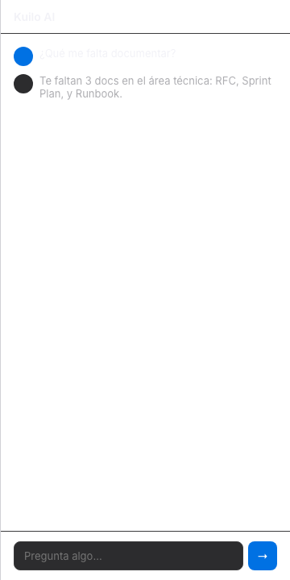

# AI Chat (Kuilo AI)

Panel de chat embebido que usa la API key del usuario para responder preguntas sobre el vault.

## Uso

1. Click **"Kuilo AI"** en el sidebar footer
2. Primera vez: elige provider y pega tu API key
3. Pregunta lo que quieras — el AI conoce tu vault

## Providers

| Provider | Modelo | Gratis | Tarjeta |
|----------|--------|--------|---------|
| **Gemini Flash** | gemini-2.0-flash | Sí | No |
| **Groq** | Llama 3.3 70B | Sí | No |
| **Cohere** | Command R | Sí | No |
| Anthropic | Claude Haiku 4.5 | No | Sí |
| OpenAI | GPT-4o mini | No | Sí |

Los providers gratis aparecen primero. Cada uno tiene un botón "Obtener API key" que abre la página del provider.

## Contexto del vault

El AI recibe automáticamente:
- Lista de todos los paquetes y páginas
- Contenido del documento activo (hasta 3000 caracteres)
- Este contexto se inyecta como system prompt — no necesitas copiar/pegar

## Doc links

Cuando el AI menciona un documento, lo muestra como un botón clickeable:

> "Revisa [📄 PRD inicial] para más detalles"

Click → abre el documento en el editor.

## Configuración

- **API key** se guarda en localStorage (nunca sale del dispositivo)
- **Settings** se ocultan después de configurar — click en ⚙ para volver a ver
- Las llamadas API van de Electron → provider directamente (sin servidor Kuilo)

## Seguridad

- La key nunca se envía a Kuilo — solo al provider que elijas
- Las llamadas se hacen desde el proceso principal de Electron (no el renderer)
- Sin telemetría, sin data collection
