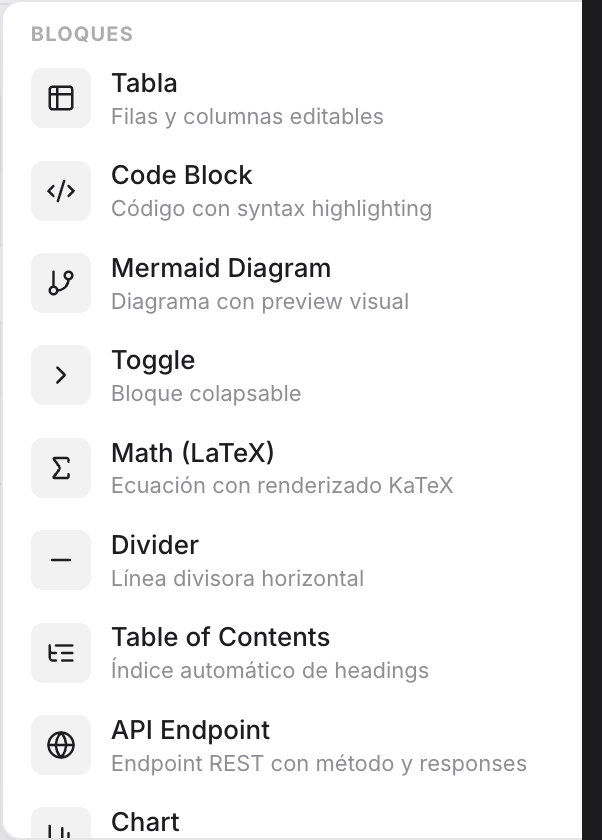

# Kanban Board

Tablero de tareas integrado en el editor con drag & drop.

## Insertar

`/kanban` o botón `+` → Kanban Board

## Funcionalidades

### Columnas
- **Agregar** columna con el botón `+ Columna`
- **Renombrar** editando el título inline
- **Eliminar** con el botón `×`
- **Contador** de tarjetas por columna

### Tarjetas
- **Drag & drop** entre columnas
- **Editar** título inline
- **Colores** — 5 opciones (azul, verde, naranja, rojo, morado) como borde lateral
- **Eliminar** con 🗑️ (aparece al hover)
- **Agregar** con `+ Agregar tarea`

## Default

Se crea con 3 columnas: **Por hacer**, **En progreso**, **Hecho**.

## Export

En Markdown: cada columna es un `### heading`, cada tarjeta es `- [ ] task`.
