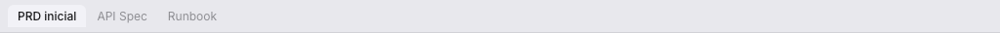

# Tabs

Multiples documentos abiertos simultaneamente, como en VS Code.

## Uso

- Click en cualquier documento del sidebar → se abre en un tab
- Click en un tab → cambia al documento
- Click en X del tab → cierra el tab
- Right-click en un tab → cierra los demas tabs
- **Cmd+W** → cierra el tab activo

## Comportamiento

- Los tabs aparecen en una barra entre el sidebar y el workspace
- El tab activo tiene fondo resaltado
- Los tabs con favorito muestran una estrella amarilla
- Al cerrar el tab activo, se selecciona el tab mas cercano
