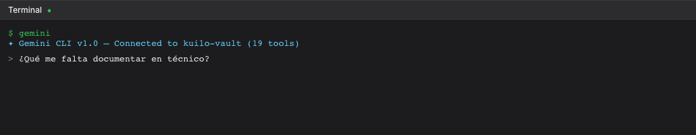

# Terminal Integrada

Terminal real embebida en Kuilo — corre bash, zsh, Claude CLI, Gemini CLI, git, npm, cualquier comando.

## Uso

- Click **"Terminal"** en el sidebar footer
- O presiona **Ctrl+`** (backtick) para toggle

## Características

- Terminal completa (PTY) con `node-pty` + `xterm.js`
- Misma terminal que usa VS Code internamente
- Tema oscuro que matchea la app
- Se abre en el directorio del vault
- Minimizable y redimensionable
- Soporte 256 colores

## Casos de uso

- Correr `claude` (Claude CLI) para interactuar con tu vault
- Correr `gemini` (Gemini CLI) para preguntas rápidas
- `git status`, `git commit` — manejo de backup manual
- `npm test`, `npm run build` — si tu vault es un proyecto de código
- Cualquier comando del sistema

## Atajos

| Atajo | Acción |
|-------|--------|
| `Ctrl+`` | Toggle terminal |
| Click ✕ | Cierra terminal y mata el proceso |
| Click ▼ | Minimiza (mantiene proceso vivo) |
